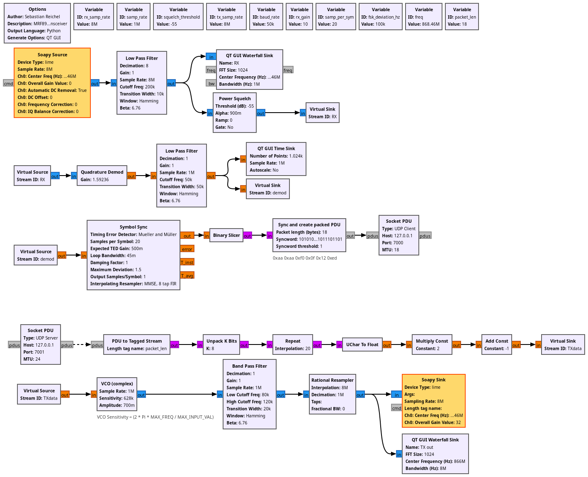

# MRF89XA Gnuradio Files

This is a Gnuradio description to simulate a MRF89XA with a
Software Defined Radio. It has been tested with a LimeSDR,
but can easily be adopted to any other hardware supported by
soapy.

Additionally cff3000.py implements the protocol used for the
equally named door lock remote control, but is missing the
encryption code. By adding the encryption code this can be
used to (un)lock CFA3000 doors. For more details, please
check the following 37C3 talk:

https://fahrplan.events.ccc.de/congress/2023/fahrplan/events/12265.html
